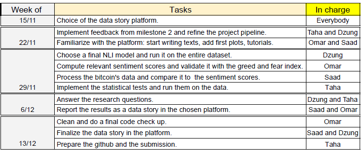

# ADA_Project

## Investigating the correlation between the news and Bitcoin's historical data.

## Abstract:
In the last five years, Bitcoin was by far the most volatile largely traded asset. Given its decentralized nature, multiple factors can manipulate its price direction. We would like to shed light on one of those factors: News. On one side, retail investors stem their entry and exit strategies (when to buy and when to sell) from the feeling conveyed by the subjective speeches of notorious public investors, which may cause drastic fluctuations in the bitcoin's price and trading volume. On the other side, news and social media are known to be very reactive to the cryptocurrency market fluctuations. A fear and greed index reproduces this aspect based on crowdsourcing feelings from social media, Google trends and surveys analysis. 
Using the Quotebank dataset, we would like to investigate the correlation and the potential causality between the news and Bitcoin’s historical data.

 
## Research Questions: 
We would like to investigate the bi-directional influence between the news and Bitcoin.
### News impacting Bitcoin: 
1) How does news from different parties impact the Bitcoin's price and trading volume? 
2) Is the Bitcoin's 2017 boom a manipulated bubble? Investigate the correlation between the Bitcoin's price within a time window centered at 2017 and different investors' speeches (e.g. Elon Musk, Jamie Dimon, Mark Cuban, Tony Robins).
3) Whether the volume of statements involving the term ‘Bitcoin’ can predict the price, volatility and trading volume of Bitcoin.
4) Do the sentiments of statements affect the price, volatility and trading volume of Bitcoin? If yes, whose statements have the most significant influence.
5) Do the sentiments of statements affect the fear and greed index? If yes, whose statements have the most significant influence.

### Bitcoin impacting news and people's opinion: 
6) How does the volatility, price and trading volume of Bitcoin affect the sentiments and the volume of statements?
7) How does this affect change in different periods (e.g. before and after Bitcoin's 2017 boom).
8) Is there a correlation between Bitcoin's news and the fear/greed index? 
9) How known investors' opinions change before and after Bitcoin surging?

## Proposed additional datasets:
- Bitcoin's data from 2014 to 2020 (https://www.kaggle.com/prasoonkottarathil/btcinusd): The dataset is available as a csv file. It contains the opening price, the closing price, the lowest price, the highest price as well as the traded volume with respect to three time intervals (1 min, 1 hour, 1 day). This Dataset will be the foundation of the statistical analysis on the variation of the Bitcoin's price & volume. More about this is discussed in the methods.

- Bitcoin's fear and greed index dataset (https://alternative.me/crypto/fear-and-greed-index/): This is a simple dataset that stores the daily fear index from February 2018 in json format. This dataset will not only be used as a reference to assess our BERT model's sentiment analysis, but also as a tool to support our analysis and to potentially validate our conclusions on how does the market/news react to Bitcoin's fluctuations. 

The datasets that are used in this project can be found [here](https://drive.switch.ch/index.php/s/0THpzFfcgiAeWi0).

## Methods:
<ul>
<li> Data loading, exploration and preprocessing: 
The first step would be to extract Bitcoin's quotes from the Quotebank dataset. Next, new potential keywords can be identified by plotting the words' occurrences within the Bitcoin's quotes dataset. These words can be used as new references to expand our quote dataset. After cleaning it, some basic statistical summaries will also be displayed in order to identify the quotes distribution over time, as well as the most relevant speakers and domain names involved in this dataset.</li> 

<li> Data processing:  
Most of our research questions involve comparing Bitcoin's data to the general sentiment in the news and the cryptocurrency market. Therefore, we will be using a sentiment analysis model as the main processing technique throughout this project. The model consists of a pre-trained NLI-based sequence classifier (https://huggingface.co/facebook/bart-large-mnli) that evaluates whether a sentence belongs to a certain class. In our case, we would evaluate whether the Bitcoin statements in the quotebank dataset are positive or negative. To do so, we would construct two hypotheses "The sentiment about bitcoin is positive" and "The sentiment about bitcoin is negative" and run the inference on the entire Bitcoin's quotes dataset. The returned probabilities will provide the agreement and contradiction between each Bitcoin statement and each hypothesis. The output probabilities related to the first and second hypothesis will be interpreted as positive and negative sentiment scores, respectively. Some sentiment scores examples are provided in the Data_analysis notebook accompanying this file. Note that other sentiment analysis models might be tested and used in our analysis, if they prove to be more suitable to our quotes dataset.</li>  

<li> Data analysis:  
As a validation step, the returned scores will be normalized and compared to the greed and fear index. We are expecting to observe some correlations between both scores, especially in time periods where the Bitcoin's price shows high volatility. The changes in the positive/negative scores should also be noticed in the fear and greed index data.  
The next step would be to compare the positive and negative scores to Bitcoin's technical indicators. The latter metrics confirm and quantify the uptrend or downtrend of Bitcoin based on both prices and volume. Such indicators include :  

<ul>
  
  <li>Moving Average Convergence Divergence (MACD) (https://www.investopedia.com/terms/m/macd.asp)</li>
  <li>Stochastic Oscillator (https://www.investopedia.com/terms/s/stochasticoscillator.asp)</li>
  <li>On-Balance Volume (OBV) indicator (https://www.investopedia.com/terms/o/onbalancevolume.asp)</li>
</ul>

In order to provide rigorous answers to the aforementioned questions, we plan to use the principles shown in the lecture to tackle this observational study. If speeches are set to be the observed covariates, no one can prove the absence of other unobserved covariates influencing the Bitcoin's prices. In fact, given the complexity and the dimensions involved in such a competitive market, we can confidently assume the existence of non-negligible unobserved covariates affecting the outcome. Therefore, a sensitivity analysis must be performed to mitigate this concern.  
Linear and nonlinear Granger causality tests will be computed to examine the dynamic relation between two variables, which in our case will be the positive/negative scores and the Bitcoin's data. To do so, a vector autoregressive model can be used to model the different time series (http://web.vu.lt/mif/a.buteikis/wp-content/uploads/2019/05/Lecture_07_Updated.pdf). The spearman index might also be relevant to check correlations in our data.</li>
</ul>
  

## Proposed timeline and organization within the team:

